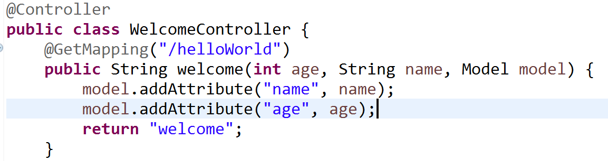

 

### Controller 생성 후 View로 데이터 전달

컨트롤러를 하나 생성했다.  

 

<mark>@Controller</mark> 어노테이션을 붙여줘야 컨트롤러로써의 역할을 수행할 수 있다.

여기서 사용자의 입력을 받아 html 페이지에 결과값을 전달한다.

메소드명은 아무래도 상관없고 return 값의 문자열을 보고 Spring이 알아서 파일을 찾아준다.

  

파라미터를 받아 model에 각각의 이름으로 넣어주면 model이 html 페이지에 가서 정보를 전달한다.

<dfn>클라이언트가 전달하는 이러한 상태값에 따라 html을 동적으로 만들어주는 도구<dfn>를 템플릿 엔진이라 한다.
ex)Mustache

  

* get = 단순 페이지 요청, 데이터 가져와서 보여주기 용도(사용자 목록 뿌리기)
 
* post = 사용자 입력 데이터를 서버에 전달하여 새로운 데이터를 추가하거나 변경할 때

`데이터를 전달한다` 라는 의미에서 get과 post는 같아 보인다.

그런데 찾아보니 전달방식, 전달량, 보안, 데이터타입 등 많은 부분에서 차이가 난다.

무엇보다도 get은 url 히스토리에 그대로 남아버리기 때문에 대부분은 post로 쓰인다.

  

---
### 데이터베이스 없는 회원가입 기능 구현

user 클래스를 하나 생성하여 model에 user를 전달.

  

<dfn>"redirect:/list"</dfn>

redirect를 안써도 같은 결과 화면이겠지만 새로고침 할 때마다 넣지 않으려는 회원이 추가 되기 때문에 쓴다.

시스템에 변화를 주는 기능이 없으면 <mark>forward</mark>를 사용하는게 좋겠다! redirect는 결국 요청이 두번 가는거니까.

  

  

잘 나왔다!

### 특정 회원의 프로필 조회하기

회원의 id를 누르면 프로필을 조회하는 기능을 구현했다.

  

<dfn>@PathVariable</dfn>dms url 경로에 변수를 넣어주는 기능이다.

mapping 뒤에 있는 userId와 어노테이션 옆에 있는 <dfn>변수명이 같아야</dfn> 한다.

  

  

심심해서 사진을 내 사진으로 바꿔봤다. 그럴듯해

어제 프로젝트 배포를 연습했더니 오늘은 처음으로 설명을 안보고 로컬 -> git -> 서버 재배포가 손에 익었다.

내일은 '질문하기'와 '회원 정보 수정'을 구현해봐야겠다.

### 짧은 이슈

프론트에 대한 지식이 전혀 없지만 css의 폰트나 색깔 정도는 바꿀 수 있겠지 하면서 css 파일을 수정했다.

아무 생각 없이 포스트 내용을 수정하고 add commit 하려는데

`Your branch is ahead of 'origin/master' by 1 commit`

대충 이런식의 메세지가 떴다. 영어를 못해서 그냥 커밋할게 있는건가 싶었다.

`your branch and 'origin/master' have diverged`

이것저것 아는 명령어를 총동원 해보다가 이정도 문구가 나와서야 뭔가 잘못됐다고 깨달았다.

나중에 vi가 켜지고 빨간 글씨로 경고 문구도 나와서 일단 bash를 꺼버렸다. 에디터를 끄는 방법조차 모르면 이게 답이라는게 슬펐다.

찾아보니 원격 저장소와 내 로컬의 상태가 서로 맞지 않아 충돌을 일으킨다고 한다.

~~~
git merge --abort
~~~

merge를 일단 취소하고 pull을 통해 원격 저장소의 변경 사항을 받아와 반영했더니 잘 돌아간다.
