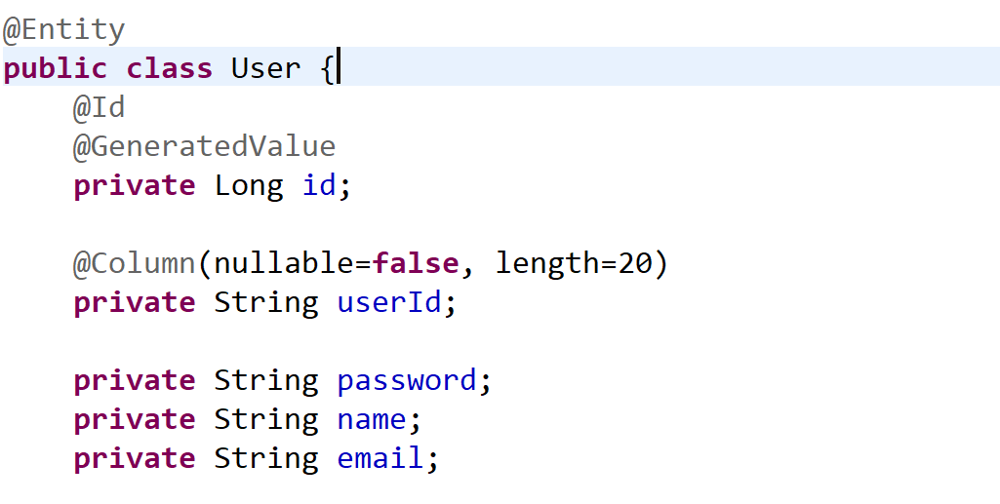
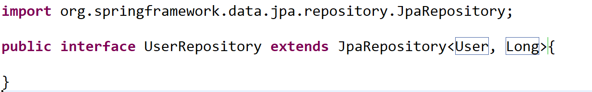
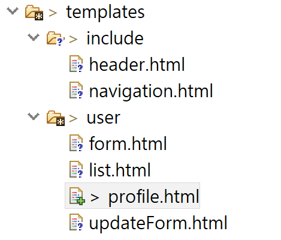
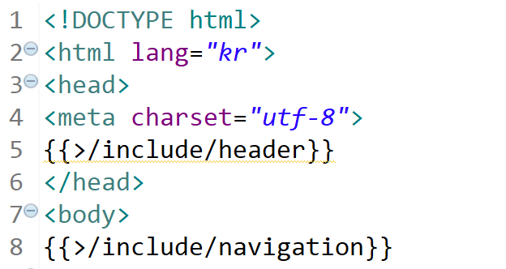
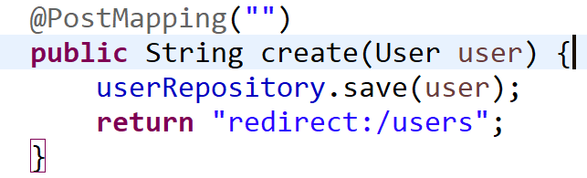
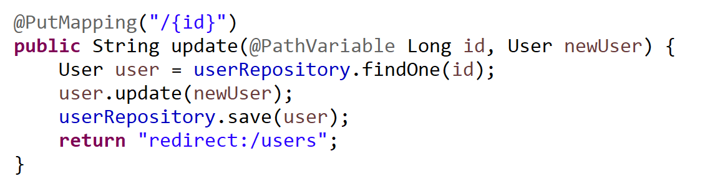

### H2 데이터베이스 설치

~~~
<dependency>
		<groupId>com.h2database</groupId>
		<artifactId>h2</artifactId>
		<version>1.4.196</version>
		<scope>runtime</scope>
</dependency>
~~~

maven repository에서 찾은 dependency 코드를 pom.xml에 추가해준다.

jpa를 사용하면 더 쉽게 쓸 수 있다 해서 jpa 설정도 몇개 추가했다.

아직은 뭐가 좋은지는 잘 모르겠다...

sql에 의존적이기만 하던 접근 방법을 완화시켜준다는것 같다.
 
---
<h1>객체를 데이터베이스 테이블에 mapping</h1>

jpa는 객체 매핑 속성에 따라 테이블을 자동 생성해준다.

User 클래스가 데이터베이스와 연결되는 클래스라는걸 인식시켜주기 위해

  

* <mark>@Entity</mark>를 추가해준다.

* <mark>@Id</mark>로 프라이머리키도 지정해줬다.

* <mark>@GeneratedValue</mark>는 숫자인 경우 데이터가 추가될 때마다 자동 증가된다.

  

`데이터베이스에 데이터를 조회 및 삽입하려면 인터페이스를 하나 추가해야된다. `

jpa의 사용 규칙 정도 되는건가?

 

이정도 설정이면 이제 데이터를 저장할 수 있다.
 
---

<h1>html 코드 중복 제거</h1>

html 파일들을 보면 기본적인 header나 navbar 등 중복되는 코드가 많다.

mustache 문법을 통해 간편하게 빼버리는 방법을 알았다.

  

<dfn>include</dfn> 폴더를 생성해서 중복 코드를 담은 html 파일들을 넣어줬다.

  

이렇게 바꿔주니까 100줄 코드가 30줄 정도로 짧아졌고 가독성이 좋아져서 원하는 부분을

수정하기 한결 편하다.
 
---

<h1>데이터 삽입 및 수정</h1>

 <dfn>삽입</dfn>

  

 <dfn>수정</dfn>

   

 인터페이스 객체에서 <mark>save</mark>는 INSERT와 UPDATE 기능을 다 가지고 있는 메소드다.

* 스프링 부트가 jpa 기본 설정할 때 데이터베이스의 테이블을 drop 시키고 만들기

 때문에 메모리 DB로밖에 동작을 안한다. 서버 재시작마다 데이터를 입력해야 하는건

 너무 불편하다... 방법을 찾아봐야겠다.

* 기본 지정된 static과 달리 template 디렉토리의 파일들은 컨트롤러를 통해 들어가야한다.

 
---

<h1>ORM (Object Relational mapping)</h1>

<dfn>ORM</dfn>은 자바 객체와 테이블 매핑을 통해 쿼리 작업을 손쉽게 도와주는 프레임워크

JPA가 ORM의 표준 기술.

* JDBC : 관계형 DB 연결과 쿼리 실행에 대한 표준을 정의한 것

* JPA : ORM에 대한 표준 인터페이스 정의

내가 dependency에 추가한건 Spring Data JPA로 더 쉽게 사용할 수 있도록 도와주는 도구다.

학교에서 jsp 공부할 때 교수님께서 내게 가르쳐주신 데이터베이스 커넥션을 생각해보면

~~~
Connection conn;
PreparedStatement ps;
String sql;
...
~~~

이렇게 생성해야 되는 준비물만으로도 이것저것 되었는데 jpa는

~~~
public interface UserRepository extends JPARepository<User, Long>
~~~

이 정도로도 CRUD 기능을 쓸 수 있다.

물론 개발자들이 익혀야 할 학습 비용이 늘어나겠지만, <dfn>데이터베이스에 대한 의존도를</dfn>

<dfn>낮춰주고 코드에 집중할 수 있게 도와준다.</dfn>

 
---

<h1>짧은 이슈</h1>

<dfn><rb>테스트 데이터 입력이 너무 귀찮다!!!</rb></dfn>

서버 재시작마다 날아가는 그놈의 메모리 데이터베이스 구조 때문에 시간이 생각보다 소모된다.

설정을 바꿀 수 있는 방법을 얼른 찾아야겠다.
