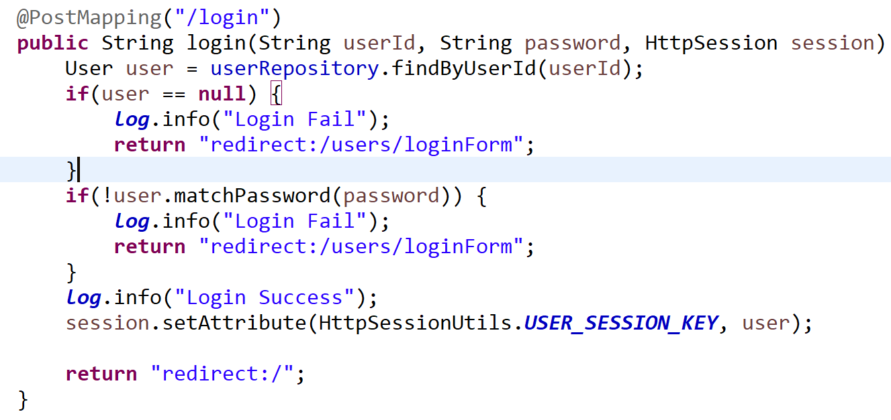
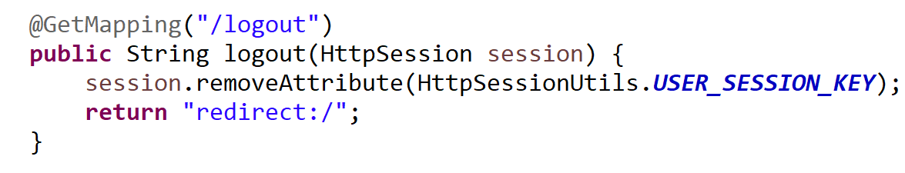
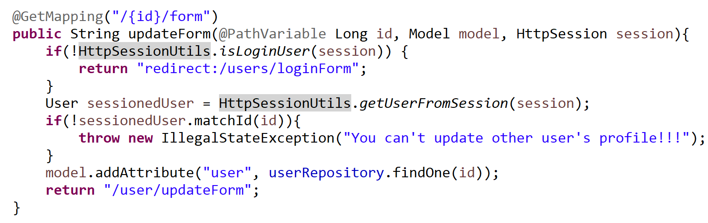
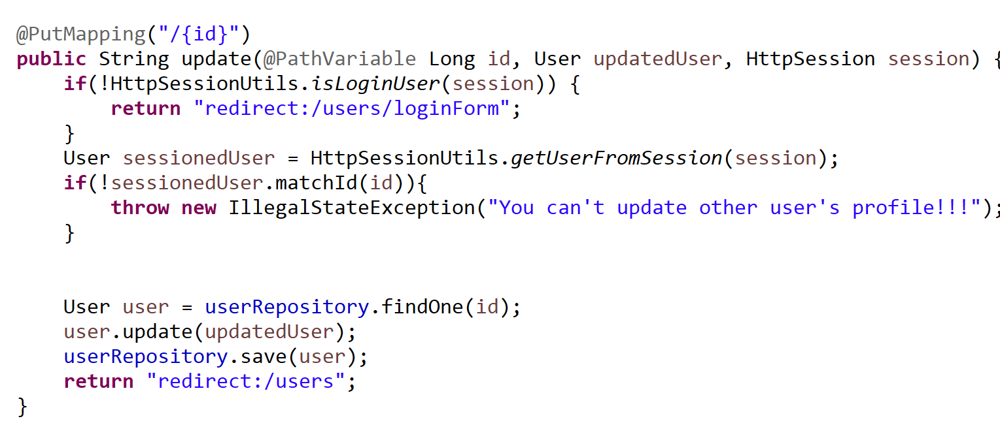
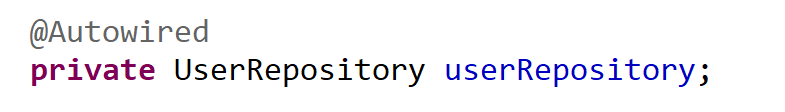

<h1>HttpSession을 사용해서 로그인과 로그아웃</h1>
<dfn></dfn>
세션 추가와 함께 <dfn>로그인</dfn>과 <dfn>로그아웃</dfn> 기능을 추가했다.

  

<rb>HttpSession session</rb>으로 받아와서 로그인 성공한 user의 정보를 전달한다.

<dfn>HttpSessionUtils</dfn> 클래스는 session에서 처리해줄만한 일을 담당하고 세션키를

가지고있다.

<dfn>세션은 메소드를 전전해도 상태를 가지고 있기 때문에 </dfn> 필요할 때 가져와서 쓰면 되고

  

로그아웃하면 removeAttribute로 정보를 날려주면 된다.

 
---
<h1>로그인 사용자에게만 해당하는 정보 보여주기</h1>

개인정보수정 화면에서 <dfn>수정</dfn>버튼을 누를때 매핑 메소드다.

  

세션정보를 활용해 로그인됐는지 확인하고, 로그인 했다면 해당 유저를 찾아 받은 id 값과

일치하는지 확인한다.
 

개인정보를 수정하고 나면

  

데이터베이스에 정보를 업데이트하고 다시 리스트를 보여준다.

* userRepository에는 기본키로 해당 객체를 반환해주는 <mark>findOne</mark> 메소드가 있다.

  

<mark>@AutoWired</mark>는 스프링에서 인터페이스인 userRepository에 대한

<dfn>구현체</dfn>를 가지고 있다가 저 표시를 보고 객체를 편히 쓸 수 있게 값을 할당해준다.

스프링이 알아서 해주는 부분이 많아서 다행이다!

 
---
<h1>쿠키와 세션</h1>

Http 프로토콜은 무상태다. 파일 전송용 프로토콜인 FTP는 인증 절차가 많아 오버헤드가 커서

빠른 정보 전달을 위한 프로토콜로 고안된게 Http고 제법 무뚝뚝한 방식이다.

책에서 보니 미용실로 비유를 하던데
 

* 무상태 미용실 : 어떻게 잘라 드릴까요? 짧게 잘라주세요  

* 상태 유지 미용실 : 평소랑 똑같이 잘라주세요. 

상태 유지 미용실의 요구를 들어주려면 <rb>평소 상태</rb>를 알아야 한다.

평소 상태를 구하기 위한 방법은 세단계로 진화하게 되는데,

 
<rb>1. </rb> <dfn> url에 정보를 전달하기 </dfn>
 

<rb>2 .</rb> <dfn>쿠키를 이용하기</dfn>
 

<rb>3. </rb> <dfn>세션을 이용하기</dfn>

 
<dfn>
첫번째 방법은 딱 봐도 보안의 취약점이 보인다. 옆사람이 내 컴퓨터 화면만 봐도 그냥 알 수

있을 정도로 레벨이 낮다.
 

두번째 방법인 <dfn>쿠키는 리퀘스트 header에 포함된 작은 정보다.</dfn> 쿠키 파일은 로컬 pc의

어딘가에 저장되고 요청때마다 서버가 쿠키를 확인한다. 옆사람이 내 컴퓨터를 만질 수 있으면

쿠키도 제법 쉽게 탈취할 수 있다.
 

세번째 방법 <dfn>세션은 서버와 클라이언트가 네트워크 연결이 지속되어있는 상태</dfn>를 칭하며

서버만 쿠키를 가지고 있도록 한다. 서버에 정보를 저장하고 <dfn>유일한 값인 세션 ID</dfn>를

발급해준다. 클라이언트는 세션 ID를 임시 저장해두고 인증에 사용한다.

 
---
<h1>짧은 이슈 </h1>

<h4>테스트 데이터를 입력하는 방법을 찾았다!</h4>

<rb> resources 디렉토리 밑에 'import.sql' 파일을 생성</rb>하고

~~~
INSERT INTO USER (필드) VALUES(값)
~~~

쿼리 작성해주고 저장하면 된다.

  

서버에 재배포를 위해 maven으로 빌드해주는데

<rb>Failed to execute goal org.apache.maven.plugins:maven-surefire-plugin:2.18.1.test...</rb>

메세지가 뜨면서 BUILD FAIL 됐다.

아, maven plugin 설치가 제대로 안먹혔나보다! 하고 프로젝트 우클릭 후 maven update를

눌렀다. 안됐다.
  

스택 오버플로우를 뒤져보니 -U를 사용해 강제로 maven을 업데이트 해주는 설정이 있길래

강제는 싫지만 빌드 실패가 더 싫기에 해줬다. 하지만 이것도 아니었다.
  

그렇군.. dependency가 애초에 빠져서 업데이트가 소용없구나!

~~~xml
<dependency>
    <groupId>org.apache.maven.plugins</groupId>
    <artifactId>maven-surefire-plugin</artifactId>
    <version>2.20.1</version>
</dependency>
~~~

 maven repository에 가서 복붙했지만 여전히 메세지가 똑같다..
  

 이 외에도 정말 여러가지 방법을 적용해봤다.

 repository 폴더 설정을 체크해봐라 해서 경로를 뒤지고 ,jre를 jdk 밑에 있는걸로 써야한다길래

 jre 경로도 바꿔주고, test는 무시하고 그냥 가라는 얘기도 있어서 test 실패해도 넘어가라는

 설정도 걸었지만 내가 원하는 결과는 아니었다.

 <rb>결론은 그냥 Java 버전 문제였다.</rb> ubuntu 서버에 가장 최신 버전인 1.9를 설치했는데

 그것 때문이라더라. 자세한 이유는 모르겠다... 그냥 최신 버전은 믿고 걸러야겠다.

 ubuntu 서버의 jdk 1.9 폴더를 'Java'로 심볼릭 링크를 걸어뒀었는데 그 부분을 변경했다.
 

 <rb>1. </rb> jdk 1.9를 지운다. 

 <rb>2. </rb> <dfn>wget --no-check-certificate --no-cookies --header "Cookie: oraclelicense=accept-securebackup-cookie" jdk 다운로드 url</dfn>  

 <rb>3. </rb> <dfn>ln -s jdk폴더이름 / Java</dfn> -> Java로 닉네임을 짓는다. 

 <rb>4. </rb> <dfn>vi .bash_profile</dfn> 편집기에 들어가 환경변수 설정을 확인

 <rb>5. </rb> <dfn>~/.bashrc/<dfn>을 입력해 재부팅 안하고도 바꾼 설정을 바로 적용할 수 있게 해준다.

   

빌드 성공 후 페이지를 로드하다가...

<rb>com.samskivert.mustache.MustacheException: Unable to load template: /include/header] with root cause</rb>

별개 다 문제다.

폴더에 들어가보면 파일이 분명 있다. 이건 <rb> 서버에서 이미 8080 포트를 사용중</rb>

이런 문제라더라.

분명 kill 했던것 같은데... 아무튼 grep으로 pid를 알아내서 죽였다.

~~~
./mvnw spring-boot:run &
~~~

jar 파일 없이 서버를 실행했다.
