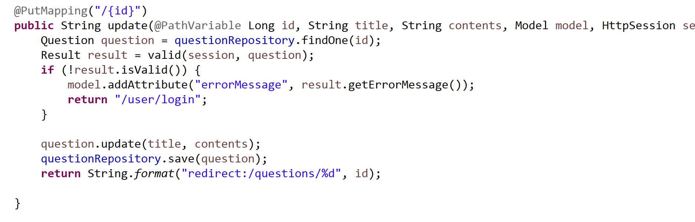
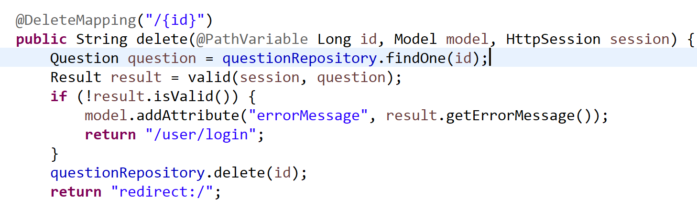
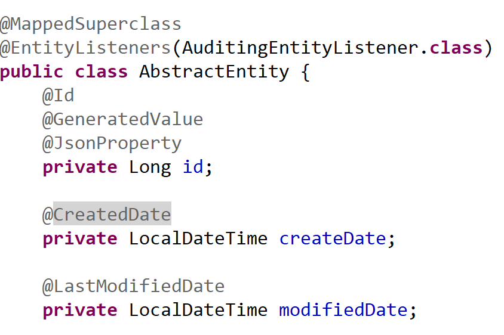

<h1>Http 메소드</h1>

질문하기 기능을 담당하는 questionController에 put과 delete mapping으로 수정 삭제 기능 구현

  

  

여태까지 배운 http 메소드는 이로써 4개가 됐다.

<mark>Get</mark>, <mark>Post</mark>, <mark>Put</mark>, <mark>Delete</mark>

용도나 데이터양 그리고 보안 등의 여러가지 기준에 따라 쓰는게 달라진다.

<h1>부모클래스 생성으로 리팩토링</h1>

Question, Answer, User 클래스에 id, createDate, modifiedDate 등이 중복되서 부모를 만들었다.

  

<mark>@mappedSuperClass</mark>로 부모임을 매핑

<mark>@EntityListeners</mark>에 <mark>AuditingEntityListener</mark>를 기본 매핑해서

Auditing을 적용하기 위한 지정을 한다. 객체를 데이터베이스에 적용하기 이전 커스텀 콜백을

요청할 수 있다.

이후에 스프링 어플리케이션을 실행하는 클래스에다가

<mark>@EnableJpaAuditing</mark> 하면 수정되는것을 감시해서 annotation 붙은 date를 인식!

<h1>RestController 사용</h1>

Controller는 view를 리턴하지만 RestController는 객체 자체를 리턴한다.

<dfn>객체를 JSON/XML 타입으로 반환하는 REST 서비스에 최적화된 간단한 컨트롤러</dfn>

controller에서는 <mark>@ResponseBody</mark>로 가능한데 RestController를 사용하면

Http Response가 자동으로 JSON 변환이 된다.

<dfn>/api/user/{id}</dfn> 앞에 api를 붙여서 url을 매핑해주는게 관례인가보다.

* swagger 라이브러리를 통해 api를 문서화하고 gui 방식으로 테스트 가능하다.

<h1>짧은 이슈</h1>

REST에 대해 공부하고 있는데 잘 모르겠다.

REST API는 자원과 행위와 표현으로 구성되어있고 특징이 이렇고 저렇고 하는데...

아직 본격적인 웹개발 경험이 부족해서 특징을 이해하는데도 한계가 있다.

웹을 최대한 활용할 수 있는 아키텍처, 설계 규격으로 일단 이해하자.

API는 내부 원리는 정확히 몰라도 사람과 프로그램간의 원활한 소통이 가능하게끔 만든 일정한 규칙이다.

Rest에서 api는 <dfn>/users/1/show</dfn> 가 아닌 <dfn>/users/1</dfn>로 정해두는것으로 알아서 put, delete, post, get 등을 통해 작업을 알아서 처리해줘야 한다는 의미인것 같다.

주절주절

 

객체를 비교하는 메소드에서 equals를 썼는데 equals 메소드 호출 결과 두 객체가 동일하면

객체 각각에 대한 hashcode 메소드 호출 시 같은 정수가 나와야 한다는 규약 때문에 오버라이드 했다.

equals & hashcode 오버라이드는 같이 해주는게 좋다!
