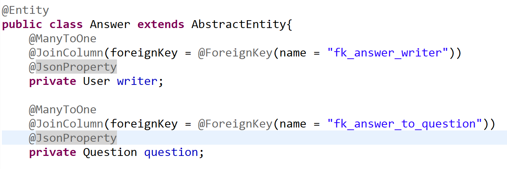

<h1> 객체 관계 매핑 </h1>

  

<dfn>@ManyToOne</dfn>

<rb>답변</rb>은 <rb>질문</rb>에 대해 여러개 달릴 수 있다.

<rb>답변</rb>은 <rb>사용자</rb>가 여러개 달 수 있다.

  

<dfn>@JoinColumn</dfn>은 외래키를 사용해 테이블 조인하는 column 설정

<dfn>@OneToMany</dfn>

<rb>질문</rb>은 여러개의 <rb>답변</rb>을 가질 수 있다.

<mark>mappedBy</mark>는 관계를 설정할 필드명(클래스명)을 입력하면 된다.

양방향 관계 설정이 됐을시 관계의 주체쪽에서 정의해준다. (이름은 Answer 클래스에서 쓰는 필드명과 같아야 한다.)

 
---
<h1> AJAX란 무엇인가 </h1>

<rb>Asynchronos Javascript And XML</rb>

  

'비동기적' 이라는 것은 요청한 뒤 서버에서 데이터를 준 후에 실행되는 함수(콜백 함수)로 일을 처리하는 것이다.

ajax는 이러한 타이밍으로 자바스크립트를 통해 json, xml등의 데이터 형식으로 데이터를 요청하는 것이다.

ajax는 브라우저 웹서버와의 통신이니 당연히 http request를 서버에 보내는데 이때 자바스크립트는

<rb>XHR</rb>이라는 오브젝트를 사용해서 xml이나 json을 받아온다. (주로 JSON을 가져온다)

* JQuery(좀 더 직관적으로 사용할 수 있는 자바스크립트의 라이브러리)를 통해 ajax를 쓸 수 있다.

 
---
<h1> 짧은 이슈 </h1>

API에 대해 공부하다가 <dfn>인터페이스</dfn>까지 와버렸다.

인터페이스는 구현체는 없고 추상메소드의 정의 부분만 있다. 인터페이스를 구현하는 클래스는

반드시 구현을 다 해줘야 한다.

ex) 회원가입 기능 구현에서 기업과 일반 사람들 정보를 받아 가입할때

기업과 일반 고객을 가입시킬때 가입 정보란에는 각각 다른 정보들이 들어갈 것이다.

데이터베이스의 필드를 채워넣을때 서로가 가진 필드를 한꺼번에 넣어서 가입시킬 것인가?

<rb>만약 기업은 사업체 번호를 필수로, 일반 고객이 휴대폰 번호를 필수로 써야 하는 경우라면 일반 고객의 회원 정보의 사업체 번호 필드는 항상 비어있을 것이다</rb>

아니면 기업 고객과 일반인 고객을 넣는 가입 기능 클래스를 분리해서 각각 만들어줄 것인가?

그러기에는 너무 중복되는 기능이 많을 것이다.

<rb>'정보를 받아 가입한다'</rb> 라는 기능적 부분은 같지만 넣어야 하는 정보는 다르다!

이때 쓸 수 있는게 인터페이스다!

인터페이스에 '정보를 받아 가입한다' 을 수행할 메소드 정의를 해놓고 구현하는 클래스에서

- 기업 고객의 정보를 받아 가입한다
- 주부 고객의 정보를 받아 가입한다
- 학생 고객의 정보를 받아 가입한다
...

이런식으로 재사용 가능하다! 말그대로 무엇을 할 것인지에 대한 명세를 써놓는 곳이다.

* 추상클래스는 부모의 기능을 가져다 쓰거나 '기능 확장'에 초점이 맞춰져있고 말그대로 클래스라

다중상속이 불가능하다. 인터페이스와는 확연히 하는 일이 다르다.
