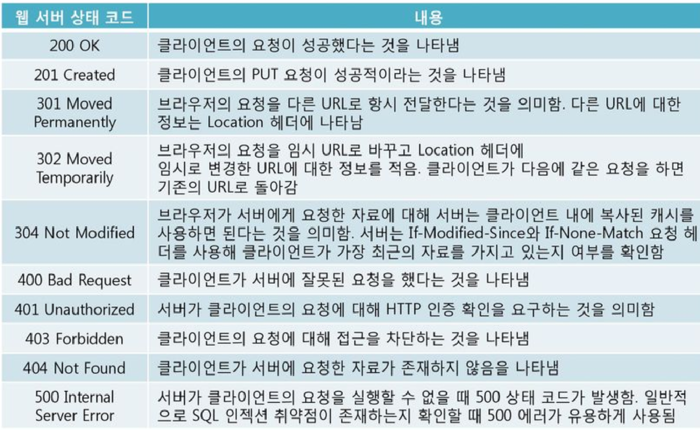

ATDD 기반으로 qna 서비스를 개발해보려 하는데, TDD가 참 까다롭다고 느낀다.

완성해나가면 나갈수록 분명 매력있는 방법일것 같은데... 초반 허들이 너무 높게 느껴진다.

분명 많은 공부가 필요하리라 생각된다. 2월 독학으로 충분할지는 많이 고려해봐야 될것 같다.

 
---
<h1>HttpEntity에 대해 조금 이해됐던 글</h1>

`Spring에서는 HttpEntity란 클래스를 제공하는데 이 클래스의 역할은 Http 프로토콜을 이용하는 통신의 header와 body 관련 정보를 저장할수 있게끔 합니다..그리고 이를 상속받은 클래스로 RequestEntity와 ResponseEntity가 존재하죠..

즉 통신 메시지 관련 header와 body의 값들을 하나의 객체로 저장하는 것이 HttpEntity 클래스 객체이고..Request 부분일 경우 HttpEntity를 상속받은 RequestEntity가, Response 부분일 경우 HttpEntity를 상속받은 ResponseEntity가 하게 됩니다..`

 
---
<h1>http status code</h1>

외워둘수록 유용한 상태 코드

login 할 때 200번인 ok를 기대했는데 post 메소드에서 redirection을 해놔서 301인가 떠야했다.

  

* 200 ~ : 성공  

* 300 ~ : redirection 관련 

* 400 ~ : client 관련 오류 ex) 가장 많이 보는 404 not found! 

* 500 ~ : server 관련 오류 

 
---
<h1>짧은 이슈</h1>

git 공부를 따로 해야 되나.. 정해진 틀에 따라 딱딱 작업을 하니까 조금만 모르는 단계가 나와도 멘붕이다. 내일 더 살펴봐야할듯...

요즘 들어 외워야할것 투성이.
