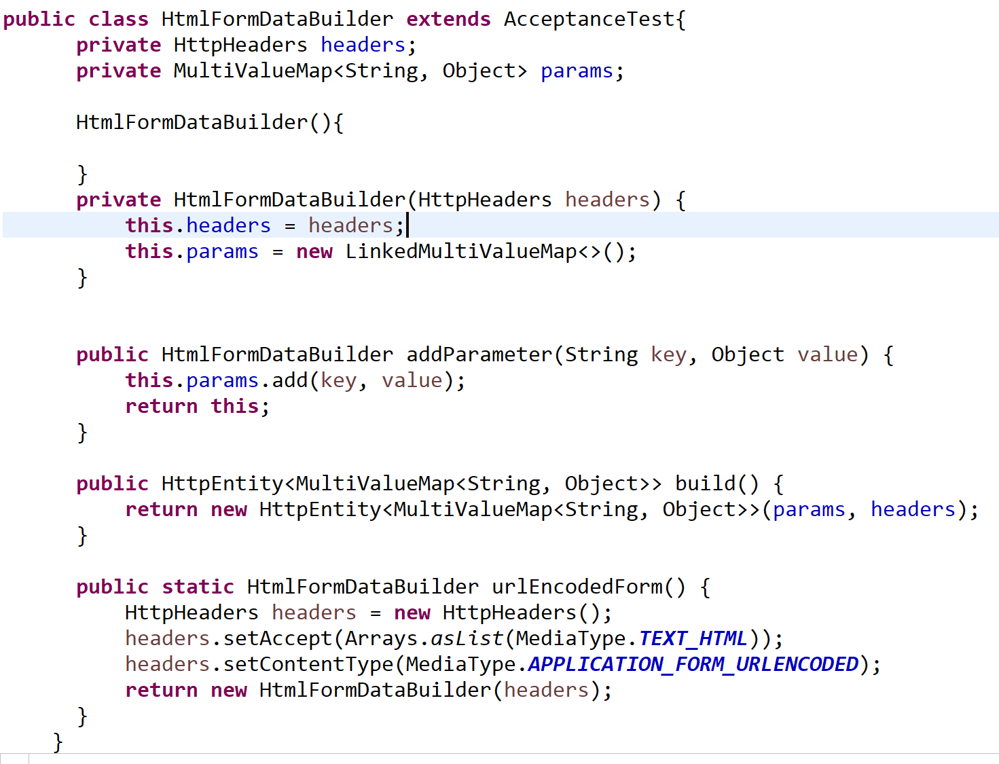

<h1> 처음으로 작성한 로그인 테스트 메소드 </h1>

회원가입 샘플 테스트 코드를 따라 로그인 테스트를 했다.

원 작성은 이정도 길이로, 리퀘스트를 보내기 위한 header,value 설정 코드가 중복되고 길었다.

  

이때 중복되는 코드를 클래스 하나로 빼서 <mark>도우미</mark> 역할을 하게 해줬다.

  

빌더 클래스를 사용하면 코드가 이정도로 줄어들 수 있다.

  

여기서 참 좋다고 느꼈던건, <dfn>addParameter 메소드</dfn>

보낼 value를 MultivalueMap에 넣어주고 넣어둔 map을 return 하면서 <rb>.addParam</rb> 형식으로

계속 쓸 수 있게 해준다. 마음에 들었다!

<dfn>HttpEntity가 헤더와 바디의 정보들을 저장해서 가지고 있고 상속받은 클래스인 RequestEntity와

ResponseEntity가 각각 정보를 주고 받고하는 역할을 해준다.</dfn>

loginSuccess뿐만 아니라 loginFail 테스트도 작성해야하는데 이 경우 컨트롤러에서

IllegalStateException을 throw 시킬 계획이라서 500을 받도록 했다.

 
---
<h1> QuickSort 공부 </h1>

면접 준비때 반짝 했던 공부 외에는 몇년만에 공부하는 퀵소트.

반을 나눠서 양쪽을 비교하고 반의 왼쪽, 오른쪽을 다시 반을 나눠서 부분정렬하면서 재귀를 도는 정렬이다.

<rb/>1</rb>. pivot(값)과 left, right(위치)를 저장
 

<rb/>2</rb>. left에 있는 값이 pivot보다 클때까지 위치를 이동, right 값을 pivot보다 작을때까지 위치를 이동
 

<rb/>3</rb>. 아직 left, right 위치가 바뀌지 않았다면 왼쪽 오른쪽 값을 바꿔준다. 그리고 1번으로 돌아감
 

<rb/>4</rb>. left, right가 서로 바뀐거라면 양쪽 부분에 대해 left, right, pivot을 각각 정해주고 재귀
 

항상 알고리즘은 말로 어떻게든 정리되 되야 코드로 쓸 수 있는것 같다. 자동완성은 없으니까...

 
---
<h1> 짧은 이슈 </h1>

http 프로토콜로 통신할때 왜 다른게 아닌 MultivalueMap에 담는지 문득 궁금해졌다.

자세히 정리해놓은 블로그는 여기.. 자바지기인줄 알고 깜짝 놀랐다.

`http://javaiyagi.tistory.com/457` 

requestBody 부분을 실행할때 RequestMappingHandlerAdapter가  requestBody에 있는 type을 지원해주는지 체크한다.

이때 spring boot의 디폴트 메세지 컨버터들이 있는데 FormHttpMessageConverter가 mulitvaluemap을 지원한다.

<rb>흔히 map에 대해 생각할 때 가장 먼저 떠오르는 hashmap에 대한 컨버터는 없었다.</rb>
