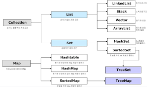

<h1>접근제어자</h1>

접근 허용 수준 : <dfn>public > protected > default > private</dfn>

protected : 같은 패키지 + 상속받은 외부 패키지 클래스 

default : 접근 제어자가 없는 패키지 내 

private : 해당 클래스 

<rb>접근제어자를 써야하는 이유는, 해당 클래스나 메소드 또는 변수가 내부적 쓰임인것인지 외부에 제공하고 있는것인지 구분하기 위해 필수적이다</rb>

 
---
<h1>final과 static</h1>

<dfn>final</dfn> : 상수라기보다는, 한번만 초기화되는 값을 표시해주는 키워드

* class : 상속x, subclass 생성x  

* method : 상속관계에서 부모 메소드 재정의x 

* variable : 변경x  

왜 final에는 반드시 static을 붙이는게 관례적인가?

- 클래스에서 생성된 모든 인스턴스에서 똑같이 쓸 것이기에 새로운 메모리를 매번 잡는게 아닌 클래스 레벨에서 한번만 잡아 쭉 쓰면 되기 때문

<dfn>위와 같은 의미에서 static은 객체레벨이 아닌 클래스 레벨에서 사용하고 싶을 때 쓰는 키워드다. </dfn>

 
---
<h1>자바 동시성</h1>

동시성 : 싱글 코어에서 멀티스레드를 동작시키기 위한 방식 (멀티코어에서는 이를 병렬성이라 부른다)

자원에 따른 동기화 처리(thread safe)가 필요한데 이 때 <mark>synchronized</mark> 키워드를 통해 데드락 상황을 방지해준다.(만병 통치약은 아니다. 남용으로 데드락에 빠질수도...)

하지만 동기화는 결국 스레드에 동시 사용을 막는것이라 성능저하를 불러 일으킬 수 있다.

 
---
<h1>Java Collection</h1>

자료구조를 관리하고 편하게 사용하려고 제공해주는 컬렉션 프레임워크

List나 Map은 정말 자주 사용하게 된다.

  

 
---
<h1>JVM</h1>

method area, heap, stack 등으로 이루어져있는 Java의 런타임 엔진!

참고 자료1 : http://mygumi.tistory.com/115?category=648758 (마이구미님 블로그, 흐름에 대해 잘 설명해주신것 같다)

참고 자료2 : http://wanzargen.tistory.com/16 (완자겐?님 블로그, 하나하나 친절한 설명이 좋다)

java를 쓰면서 jvm에 대해 처음 공부하는게 참 새삼스럽고 이상하다.
