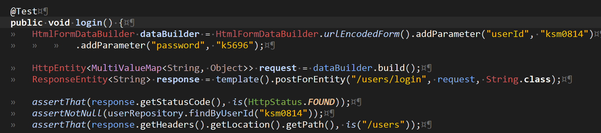
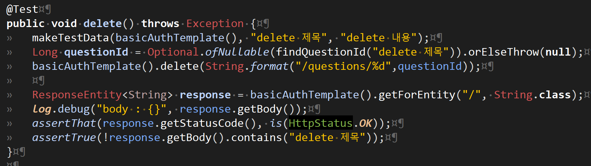
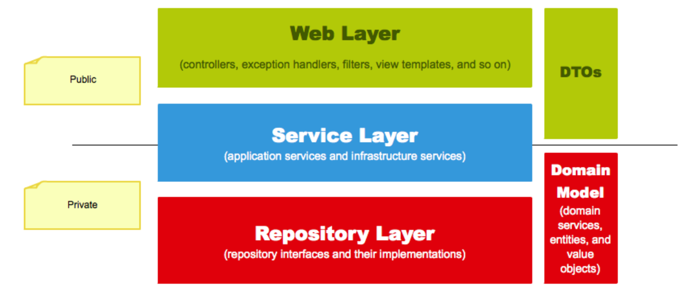

<h1>Q&A 시스템, ATDD</h1>

시작은 정말 멘붕이었다.

이제 웹 프로그래밍의 반복주기를 한두번 경험해본것뿐인데 정말 웹프로그래밍을,

그것도 테스트 기반으로 하려니 뭐부터 만들고 써야할지 잘 몰랐다.

시작할 때 제일 안좋았던 점은 모르니까 괜히 쫄아있었다는 것,

제일 나았던 점은 스스로 왜 인수 테스트가 필요한지 깨달았다는 것이었다.

반복주기를 겪으면서 끊임없는 <mark>사용자 만들기</mark>, <mark>로그인 하기</mark>, <mark>글쓰기</mark>의 반복...

사용자야 sql문으로 넣는다쳐도 로그인과 로그아웃을 와리가리하는건 고통이었다.

이 고통이 ATDD로 해결될수 있다면 시도해볼만 했다.

CTRL+N 을 누르고 'LoginAcceptanceTest'을 생성!

 
---
<h1>클릭이 전부였던 클라이언트 코드를 어떻게 작성하지?</h1>

<rb>주어진 입력칸이 있어서 submit 누르기를 자바로 클라이언트 코드를 작성하시오.(?점)</rb>

고등학교 서술형 문제를 풀듯 문제에 점수가 매겨진다면 분명 나는 100점짜리로 줄것이다.

acceptanceTest를 한참 보다가 포비에게 도움을 요청하니 HttpEntity로 요청을 보내고

해당 응답을 ResponseEntity로 받아 status 코드를 확인하면 된다고 한다.

설명을 듣고나니 그럭저럭 코드를 작성할 수 있게 된다.

(HTTP~가 붙은것들은 이름도 참 어려워서 영타 속도가 급격히 느려졌었다)

  

<dfn>HttpStatus.NOT_FOUND</dfn>, 상태 코드를 보니 웹서핑을 할때 가끔 접하는것들이 보인다.

아 이게 클라이언트 요청에 대한 응답 상태를 표시하는거구나. (에러만 보여주는거겠지만..)

 
---
<h1>뭐? 테스트 코드는 순서대로 실행되는 아니었어?!</h1>

그야말로 충격의 명제... 심지어 테스트 코드가 끝나도 데이터베이스의 데이터는 남아있다.

Question Test에 CRUD 기능에 대한 테스트를 다 추가하고 전부 초록불이 뜨는걸 분명 봤다.

하지만 class 전체를 돌려보면 어김없이 한두군데 빨간불이 켜진다. 그것도 일정하지 않다.

그리고 나에게 가장 큰 고민을 안겨준 메소드는 'Delete'였다.

  

(이건 완성본, 그나저나 orelseThrow supplier에 null 넣으면 안되는데..)

결론적으로 문제는 각 테스의 해당 테스트 데이터를 만들지 않고 한번만 생성해둔 나의 잘못.

만약 delete가 먼저 실행되고 update가 실행되면 없는 데이터를 update 하려니 당연히 오류가 난다.

테스트는 독립적이어야 한다!!

 
---
<h1>RESTful하게 짠다는것</h1>

REST는 아직 나에게 난제다.

지금까지 내가 이해한 바로 Restful하게 프로그래밍한다는건 엄청난 규칙 또는 설계원칙을 가지고 프로그래밍 한다는 것이다.

구글링 해보면 지켜야 하는것도 얼마나 많은지..

그중에 적용해볼것은 URL에 일부러 <dfn>users/update</dfn> 이라던가 <dfn>users/delete</dfn> 등으로 전달하지 않고 id만 넘겨주면 그 안에서 mapping을 알아서 해주게끔 만들어 원하는 update나 delete를 수행시키는 것이다.

그리고 ApiController를 @RestController를 활용해서 작성하는것!

Rest는 더 공부해야할듯...

 
---
<h1>Web, Service, Reposotory</h1>

  

프로젝트를 끝내고나니 눈에 잘 들어왔던 그림.
